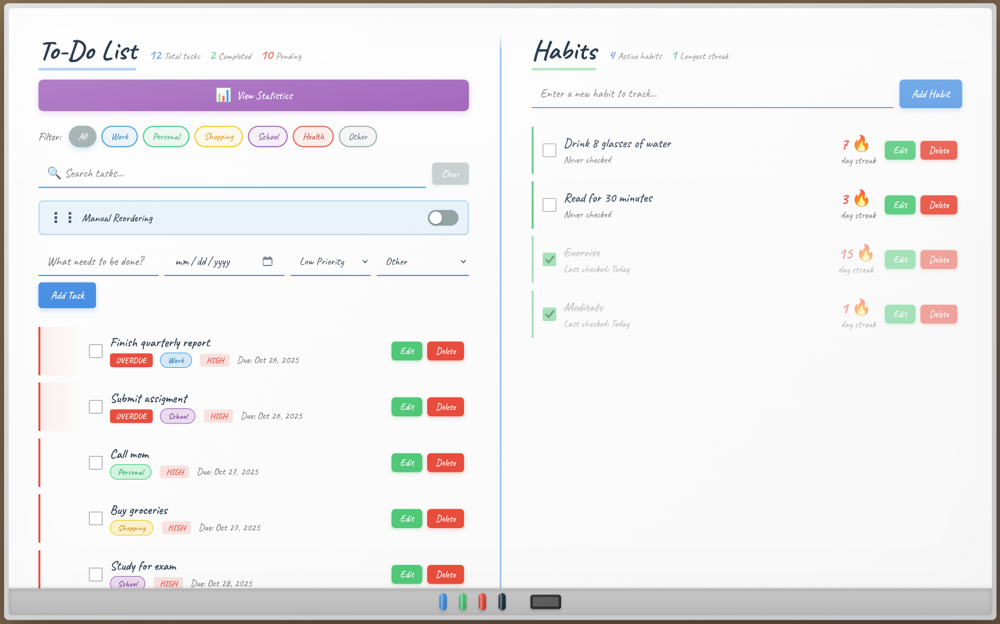
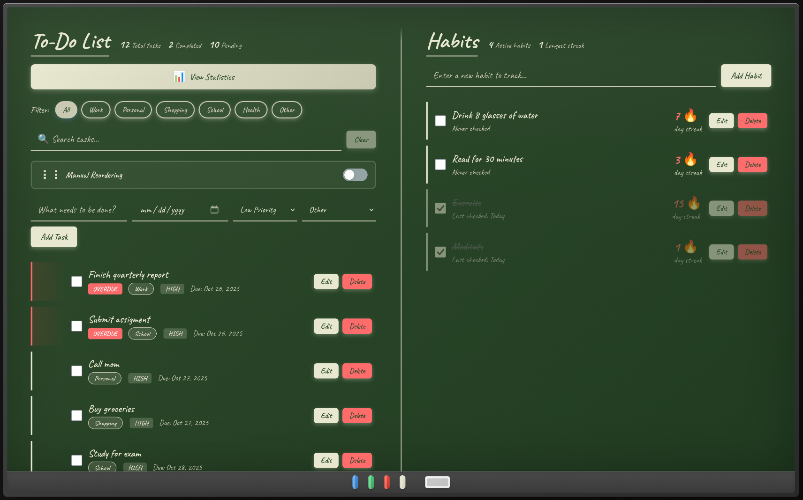
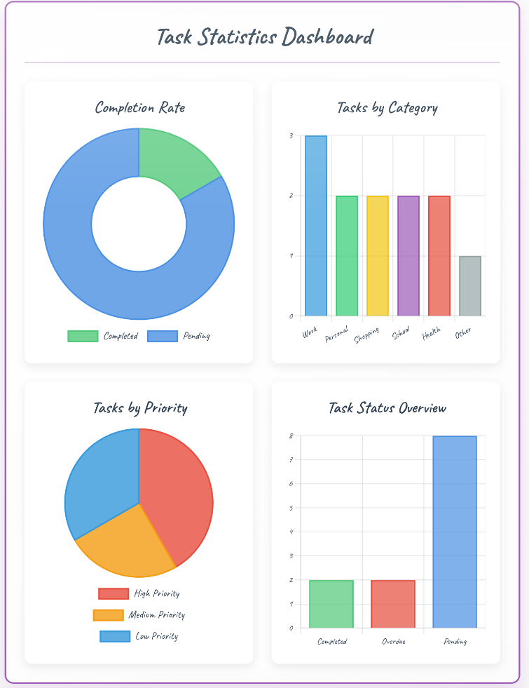
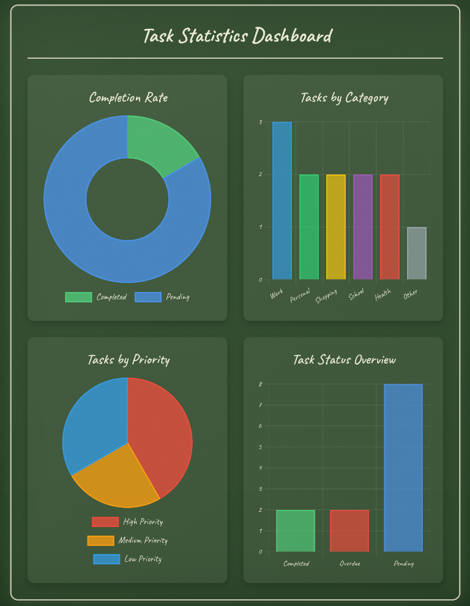
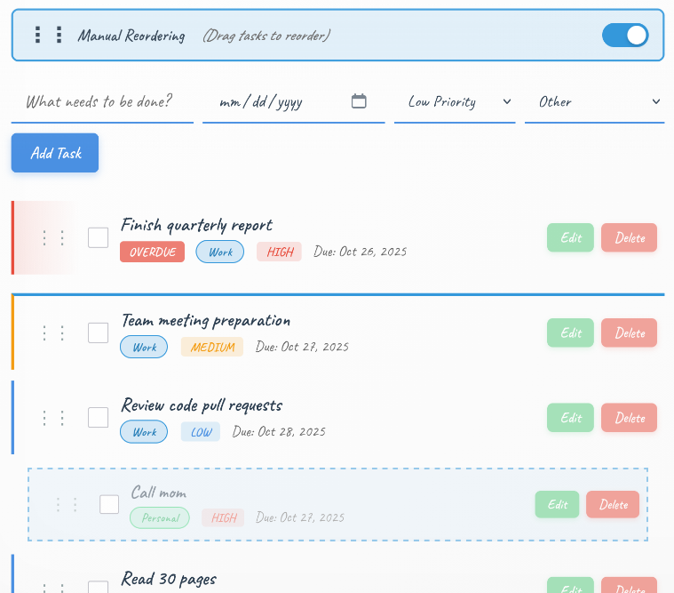
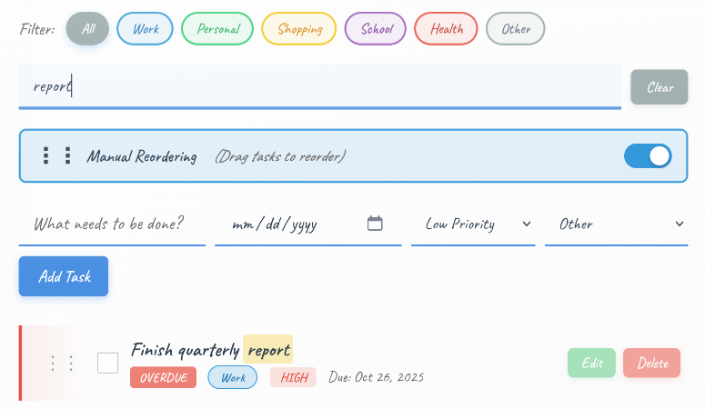

# Classroom Whiteboard - Task & Habit Tracker

*Light mode - Classic whiteboard with colorful markers*


*Dark mode - Cozy chalkboard theme for nighttime productivity*


*Interactive statistics dashboard with real-time charts*


*Dashboard in chalkboard theme*


*Manual task reordering with drag and drop*


*Search, filtering, and overdue detection in action*

---

## Key Features

### Task Management
- Custom task descriptions
- Due date scheduling
- Three priority levels
- Six category tags
- Edit existing tasks
- Mark as complete
- Delete tasks
- Automatic priority sorting
- Overdue detection
- Real-time statistics

### Habit Tracking
- Daily check-in system
- Streak counter
- Edit habit names
- Longest streak tracking
- Streak preservation on edit
- Automatic date tracking
- Visual progress indicators

### Search and Filtering
- Real-time search
- Keyword highlighting
- Category filters
- Combined filtering
- Clear search button

### Statistics Dashboard
- Completion rate chart
- Category distribution chart
- Priority breakdown chart
- Status overview chart
- Real-time updates
- Theme-aware colors
- Collapsible panel

### Drag and Drop
- Manual task reordering
- Visual drag handles
- Ghost effect feedback
- Drop zone indicators
- Custom order persistence
- Toggle auto/manual sort

### Theme System
- Whiteboard light mode
- Chalkboard dark mode
- Eraser theme toggle
- Smooth transitions
- Persistent preference

### User Experience
- Toast notifications
- Inline editing
- Keyboard support
- Data persistence
- Responsive design
- Offline functionality

---

## Prerequisites

- A modern web browser (Chrome, Firefox, Safari, or Edge)
- No installation required
- No server needed
- No account or login required

---

## Technologies Used

**Frontend:**
- HTML5 - Semantic structure and markup
- CSS3 - Advanced styling with variables, animations, transitions
- JavaScript (ES6+) - Core functionality and interactivity

**Libraries:**
- Chart.js 4.4.0 - Data visualization and charting

**APIs:**
- LocalStorage API - Client-side data persistence
- HTML5 Drag and Drop API - Manual task reordering

**Design:**
- CSS Grid and Flexbox - Responsive layouts
- CSS Custom Properties - Dynamic theming
- Google Fonts (Caveat) - Handwritten typography

**Development:**
- Vanilla JavaScript - No frameworks
- Modular architecture - Separated concerns
- Git version control - Clean commit history

---

## Quick Start Guide

### Option 1: Clone Repository
```bash
# Clone the repository
git clone https://github.com/YOUR-USERNAME/todo-habit-tracker.git

# Navigate to project directory
cd todo-habit-tracker

# Open in browser
open index.html
```

### Option 2: Download ZIP

1. Download the repository as ZIP
2. Extract to your desired location
3. Open `index.html` in your browser

### Option 3: Local Server (Optional)
```bash
# Using Python 3
python -m http.server 8000

# Using Node.js (http-server)
npx http-server

# Visit http://localhost:8000
```

### Option 4: Live Demo

Visit the deployed application: [Live Demo](https://izzatrifaieerwan-bo.github.io/todo-habit-tracker)

---

## Data Storage

All data is stored locally in your browser using the LocalStorage API:
- Tasks and habits persist across sessions
- Theme preference is remembered
- Custom task order is saved
- No data leaves your device
- No server or database required

---

**Live Demo:** [https://izzatrifaieerwan-bo.github.io/todo-habit-tracker](https://izzatrifaieerwan-bo.github.io/todo-habit-tracker)

**Last Updated:** [27/10/2025]
```