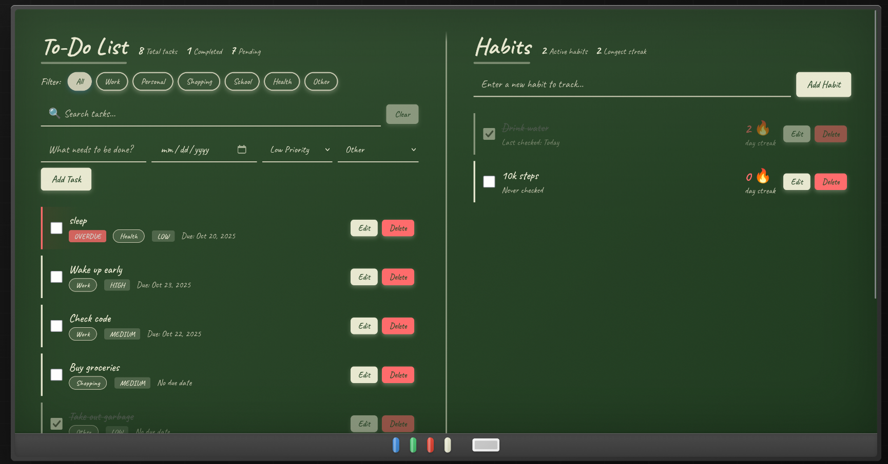

# Classroom Whiteboard - Smart Task & Habit Tracker

A beautifully designed productivity web application that captures the authentic feel of a classroom whiteboard. Manage your tasks and build lasting habits in an environment that combines nostalgia with modern functionality. Features a stunning chalkboard dark mode for late-night productivity sessions!


*Light Mode - Classic whiteboard with colorful markers*


*Dark Mode - Cozy chalkboard theme for nighttime work*

---

## Key Features

### Dual Theme System
- **Whiteboard Mode** - Bright, clean workspace with colorful markers
- **Chalkboard Mode** - Dark, cozy theme with chalk-style text
- **Interactive Toggle** - Click the eraser to switch themes
- **Smart Persistence** - Remembers your theme preference
- **Smooth Transitions** - Beautiful 0.6s animations between modes

### Advanced Task Management
- Create tasks with custom descriptions
- Set due dates for better planning
- Assign priority levels (High, Medium, Low) with color coding
- **Organize with categories** (Work, Personal, Shopping, School, Health, Other)
- **Edit existing tasks** with highlighted edit mode
- Mark tasks as complete with satisfying checkboxes
- Delete tasks when no longer needed
- **Automatic priority-based sorting**
- **Overdue detection** with red badges and visual alerts
- Real-time statistics tracking

### Smart Search & Filtering
- **Real-time search** - Find tasks as you type
- **Search highlighting** - See matching text highlighted in yellow
- **Category filters** - Show/hide tasks by category
- **Combined filtering** - Search + category + overdue work together
- Clear button to reset search instantly

### Habit Tracking with Streaks
- Build and track daily habits
- **Edit habit descriptions** without losing progress
- **Streak counter** with fire emoji for motivation
- **Daily check-in system** with automatic date tracking
- Smart streak calculation (consecutive days)
- **Streak breaks** reset automatically if you miss a day
- View your longest streak achievement
- Visual progress indicators

### Overdue Task Detection
- **Automatic detection** of tasks past their due date
- **Red "OVERDUE" badge** with subtle pulse animation
- **Priority sorting** - Overdue tasks appear first
- **Visual urgency** with red left border and background glow
- Completed tasks excluded from overdue detection

### Data Persistence
- All data saved locally in your browser using localStorage
- Tasks, habits, categories, and theme preference persist
- No account, login, or server required
- Works completely offline after first load
- Edit history preserved automatically

### Authentic Design
- **Realistic whiteboard** with aluminum frame and rounded corners
- **Bottom marker tray** with colored markers (blue, green, red, black) and eraser
- **Handwritten Caveat font** for natural, classroom feel
- **Side-by-side layout** - To-Do List | Habits (no tab switching)
- **Textured wall background** for depth and realism
- **Glossy board surface** with subtle shine effect
- **Smooth animations** throughout the interface

---

## Getting Started

### Prerequisites
- A modern web browser (Chrome, Firefox, Safari, Edge)
- No installation or server required!
- Works completely offline after first load

### How to Use
1. **Download or clone** this repository
```bash
   git clone https://github.com/yourusername/todo-habit-tracker.git
```
2. Open `index.html` in your web browser
3. Start adding tasks and habits on your digital whiteboard!

---

## Theme Switching

### Light Mode (Whiteboard)
Perfect for daytime productivity with a bright, clean interface that mimics a real classroom whiteboard.

**Visual Features:**
- Soft white board surface with subtle gloss
- Brown textured classroom wall
- Colorful marker accents (blue, green, red)
- Dark text for high contrast
- Dark eraser (signals it's clickable)

### Dark Mode (Chalkboard)
Ideal for late-night work sessions with reduced eye strain and a cozy atmosphere.

**Visual Features:**
- Dark green chalkboard surface
- Nearly black classroom wall
- Chalk-white text throughout
- Muted, chalk-toned category badges
- Light eraser (signals it's clickable)
- Subtle chalk dust texture

**To Switch Themes:**
Simply click the eraser in the bottom marker tray! It acts as an intuitive, thematic toggle button.

---

## Technologies Used

- **HTML5** - Semantic structure and markup
- **CSS3** - Advanced styling with CSS variables, gradients, animations
- **JavaScript (ES6)** - Modern syntax with arrow functions, template literals, array methods
- **LocalStorage API** - Client-side data and preference persistence
- **Google Fonts (Caveat)** - Handwritten font for authentic classroom feel
- **CSS Variables** - Dynamic theming system
- **Flexbox & Grid** - Responsive layout structure

---

## Project Structure
```
todo-habit-tracker/
├── index.html              # Main HTML file with whiteboard structure
├── css/
│   └── styles.css          # Complete styling (themes, board, animations)
├── js/
│   ├── app.js              # App initialization, theme toggle, event listeners
│   ├── tasks.js            # Task CRUD operations, search, filtering, overdue detection
│   └── habits.js           # Habit management and streak calculation
├── assets/
│   ├── whiteboard-light.png   # Light mode screenshot
│   ├── chalkboard-dark.png    # Dark mode screenshot
│   └── images/                # Additional assets
└── README.md               # Project documentation
```

---

## How It Works

### Managing Tasks

**Add a Task:**
1. Enter task description in the input field
2. Optionally set a due date using the date picker
3. Choose a priority level (Low/Medium/High)
4. Select a category from the dropdown
5. Click **"Add Task"** or press **Enter**

**Edit a Task:**
1. Click the **green "Edit"** button on any task
2. Form highlights in yellow (edit mode)
3. Modify any field (text, date, priority, category)
4. Click **"Save Changes"** or **"Cancel"**

**Search Tasks:**
1. Type in the search bar to filter tasks in real-time
2. Matching text is highlighted in yellow
3. Click **"Clear"** to show all tasks again

**Filter by Category:**
1. Click any category button (Work, Personal, etc.)
2. Only tasks in that category appear
3. Click **"All"** to show everything

**Complete a Task:**
- Check the checkbox to mark as done (adds strikethrough)
- Task becomes semi-transparent

**Delete a Task:**
- Click the red **"Delete"** button to remove permanently

### Building Habits

**Add a Habit:**
1. Enter the habit you want to build (e.g., "Exercise daily")
2. Click **"Add Habit"** or press **Enter**

**Track Your Streak:**
1. Check the box daily to maintain your streak 🔥
2. Streaks increase automatically with consecutive check-ins
3. Missing a day resets the streak on next check-in
4. Uncheck to reset streak to 0 (if checked by mistake)

**Edit a Habit:**
1. Click **"Edit"** to change the habit name
2. Your streak is preserved during editing!

**View Statistics:**
- See total active habits and your longest streak
- Stats update in real-time

### Overdue Tasks

Tasks automatically become "overdue" when:
- The due date has passed
- The task is not yet completed

**Visual Indicators:**
- Red **"OVERDUE"** badge with pulse animation
- Red left border
- Subtle red background glow
- Sorted to appear first in the list

**Note:** Completed tasks are never marked as overdue.

---

## Feature Highlights

### Smart Sorting
Tasks are automatically sorted by:
1. **Overdue status** (overdue tasks first)
2. **Priority level** (high → medium → low)

This ensures your most urgent tasks are always visible at the top!

### Combined Filtering
All filter types work together seamlessly:
- Search by keyword
- Filter by category
- See overdue tasks highlighted
- Sort by priority

### Real-Time Updates
Everything updates instantly:
- Statistics recalculate automatically
- Search results appear as you type
- Theme switches smoothly
- No page refreshes needed

### Keyboard Shortcuts
- **Enter** - Submit task/habit from input field
- **Click Eraser** - Toggle theme (whiteboard ↔ chalkboard)

---

## Learning Outcomes

This project demonstrates proficiency in:

**Frontend Development:**
- Semantic HTML5 structure
- Advanced CSS3 (variables, gradients, animations, transitions)
- Modern JavaScript (ES6+)
- Responsive web design
- Progressive enhancement

**JavaScript Concepts:**
- DOM manipulation and traversal
- Event handling (click, input, keyboard)
- Array methods (filter, map, sort, find)
- Date comparison and manipulation
- LocalStorage API for persistence
- String manipulation and regex
- State management

**CSS Techniques:**
- CSS custom properties (variables) for theming
- Flexbox and Grid layouts
- CSS animations and transitions
- Pseudo-elements for visual effects
- Media queries for responsive design
- Color theory and accessibility

**UX/UI Design:**
- Thematic consistency (classroom aesthetic)
- Visual hierarchy and information architecture
- Interactive feedback (hover states, animations)
- Accessibility considerations
- Mobile-first responsive approach
- Intuitive iconography (eraser as toggle)

---

## Author

Created as a portfolio project to demonstrate:
- Advanced CSS techniques and theming
- Vanilla JavaScript proficiency
- Creative UI/UX design
- Data persistence and state management
- Responsive web design principles
- Clean, maintainable code structure

**Skills Showcased:**
- HTML5, CSS3, JavaScript (ES6+)
- LocalStorage API
- CSS Variables & Theming
- Responsive Design
- UI/UX Design
- Version Control (Git)

---

## Quick Start Guide
```bash
# Clone the repository
git clone https://github.com/yourusername/todo-habit-tracker.git

# Navigate to the project directory
cd todo-habit-tracker

# Open in browser (no build step needed!)
open index.html

# Or use a local server
python -m http.server 8000
# Then visit http://localhost:8000
```

---