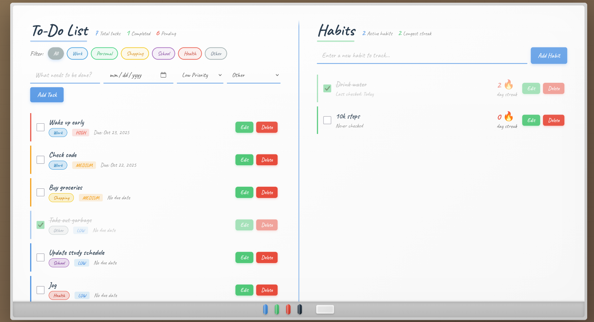

# 📋 Smart To-Do & Habit Tracker

A modern, responsive web application for managing tasks and building lasting habits. Features priority management, due dates, and streak tracking to help you stay organized and motivated.


<!-- Add a screenshot later by taking one and saving it as assets/screenshot.png -->

## Features

### Task Management
- Create tasks with custom descriptions
- Set due dates for better planning
- Assign priority levels (High, Medium, Low)
- Mark tasks as complete with visual feedback
- Automatic priority-based sorting
- Real-time statistics tracking

### Habit Tracking
- Build and track daily habits
- Streak counter to maintain motivation
- Daily check-in system
- Automatic streak calculation
- View your longest streak achievement

### Data Persistence
- All data saved locally in your browser
- Tasks and habits persist across sessions
- No account or login required

### Modern Design
- Clean, intuitive interface
- Responsive design for mobile and desktop
- Beautiful gradient theme
- Smooth animations and transitions

## Getting Started

### Prerequisites
- A modern web browser (Chrome, Firefox, Safari, Edge)
- No installation or server required!

### How to Use
1. Download or clone this repository
2. Open `index.html` in your web browser
3. Start adding tasks and habits!

Or visit the live demo: [View Live Demo](#) 
<!-- Add your GitHub Pages link here after deployment -->

## Technologies Used

- **HTML5** - Structure and content
- **CSS3** - Styling and animations
- **JavaScript (ES6)** - Functionality and interactivity
- **LocalStorage API** - Data persistence

## Project Structure
```
todo-habit-tracker/
├── index.html          # Main HTML file
├── css/
│   └── styles.css      # All styling
├── js/
│   ├── app.js          # Main app logic
│   ├── tasks.js        # Task management
│   └── habits.js       # Habit tracking
├── assets/
│   └── images/         # Images and icons
└── README.md           # Project documentation
```

## How It Works

### Tasks
1. Enter a task description
2. Optionally set a due date
3. Choose a priority level
4. Click "Add Task" or press Enter
5. Check the box to mark complete
6. Delete tasks when no longer needed

### Habits
1. Enter a habit you want to build
2. Click "Add Habit"
3. Check the box daily to maintain your streak
4. Streaks increase when checked on consecutive days
5. Streaks reset if you miss a day